# Active Directory Helpdesk Lab

**Status: Completed ✅**

## Project Overview

This project simulates common 1st Line / IT Helpdesk tasks in a small Windows domain environment.

I built a Windows Server 2022 Active Directory domain, configured DNS, created organisational units, users and security groups, performed common user administration tasks, joined a Windows 11 workstation to the domain and deployed Group Policy.

The lab was built in Oracle VirtualBox using an isolated internal network.

## Lab Environment

| System | Role | IP Address |
|---|---|---|
| DC01 | Windows Server 2022 Domain Controller / DNS | `192.168.50.10` |
| CLIENT01 | Windows 11 Pro Domain Workstation | `192.168.50.20` |

**Domain:** `helpdesklab.local`  
**VirtualBox Network:** `ITLabNet` (Internal Network)

## Skills Demonstrated

- Active Directory Domain Services (AD DS)
- Windows Server 2022 administration
- Active Directory Users and Computers
- Organisational Units (OUs)
- User account administration
- Security group management
- Password resets
- Disabling user accounts
- DNS configuration and troubleshooting
- Static IPv4 configuration
- Windows domain joining
- Domain authentication
- Group Policy Management
- Group Policy deployment and verification
- Windows 11 administration
- Command-line troubleshooting
- Joiner / Mover / Leaver concepts
- Technical documentation

## Active Directory Structure

I created an `Employees` OU with departmental OUs for IT, HR and Sales, alongside dedicated Workstations, Groups and Disabled Users OUs.

Example user accounts included:

- Aisha Khan (`akhan`)
- Daniel Smith (`dsmith`)
- Maya Patel (`mpatel`)

Security groups included `GG-HR`, `GG-Sales` and `GG-IT`.

For example, Aisha Khan was assigned to the `GG-HR` security group.

## Helpdesk Administration

I practised common Active Directory support tasks including resetting user passwords, managing security group membership and disabling user accounts.

These tasks simulate typical requests handled by a 1st Line / IT Support technician.

## Windows 11 Client

I deployed a Windows 11 Pro VM and configured it with:

- Hostname: `CLIENT01`
- IPv4 address: `192.168.50.20`
- DNS server: `192.168.50.10`

I successfully joined CLIENT01 to `helpdesklab.local` and moved the computer object into the `Workstations` OU.

I then logged into CLIENT01 using the domain account `HELPDESKLAB\akhan`.

The command:

`whoami`

confirmed the authenticated domain user, while:

`echo %logonserver%`

confirmed that authentication was being handled by `DC01`.

## Group Policy

I created a Group Policy Object named:

`Workstation Security Policy`

The GPO was linked to the `Workstations` OU.

As a security configuration example, I configured a minimum password length of **12 characters** for workstation local accounts.

On CLIENT01 I ran:

`gpupdate /force`

to refresh Group Policy.

I then verified the result using:

`gpresult /r /scope computer`

which confirmed that `Workstation Security Policy` was successfully applied to CLIENT01.

## Troubleshooting

During the project, CLIENT01 could successfully ping the Domain Controller at `192.168.50.10`, but DNS queries to the server initially timed out.

I tested DNS directly on DC01 and confirmed that the DNS service was resolving `helpdesklab.local` locally. This helped isolate the problem to communication between the client and DNS server rather than the DNS zone itself.

I resolved the issue by allowing inbound DNS traffic on DC01 for UDP and TCP port 53.

After the change, CLIENT01 successfully resolved the domain and was able to join `helpdesklab.local`.

This demonstrated a structured troubleshooting approach:

**Connectivity → DNS service → firewall → resolution → domain join**

## Evidence

### Active Directory Domain Services
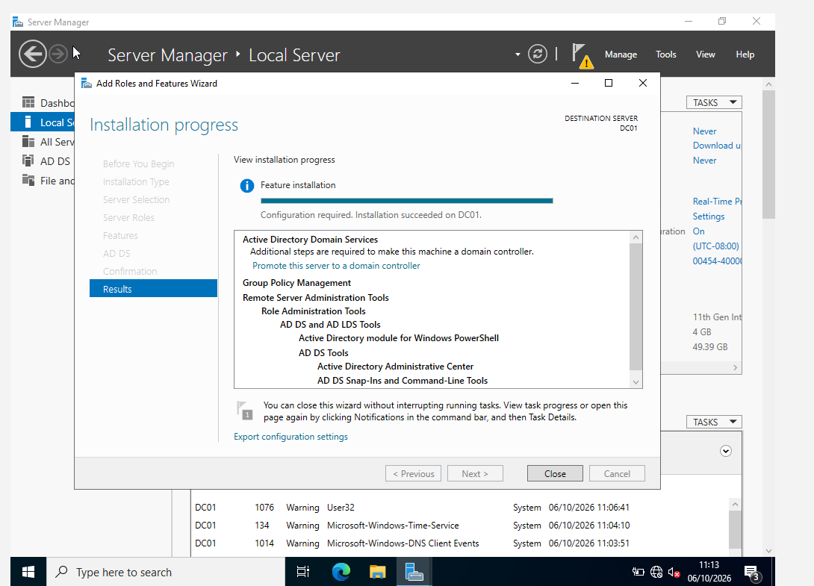

### Organisational Unit Structure
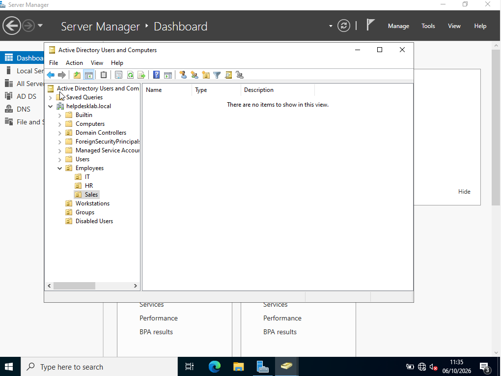

### Security Group Membership
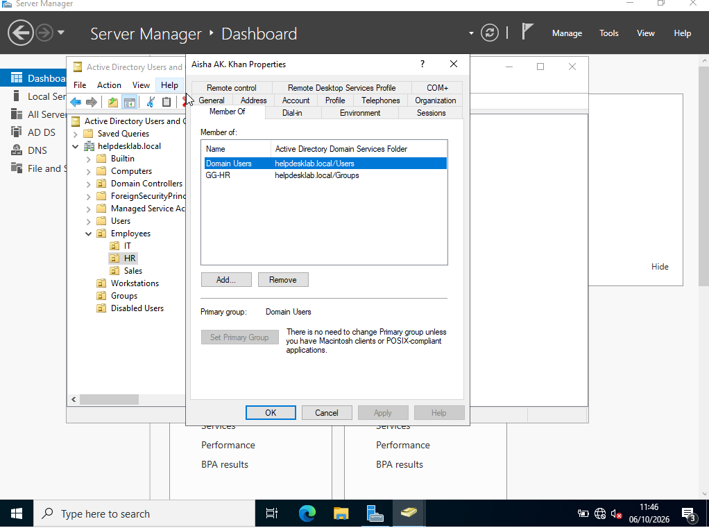

### Password Reset
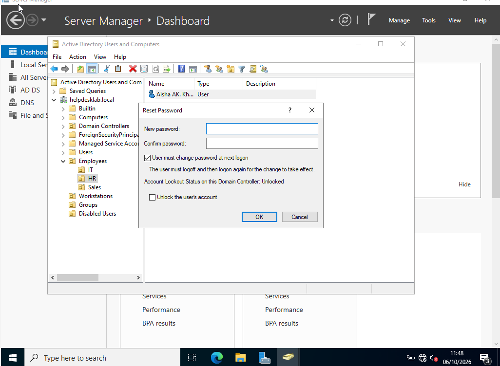

### Disabling a User Account
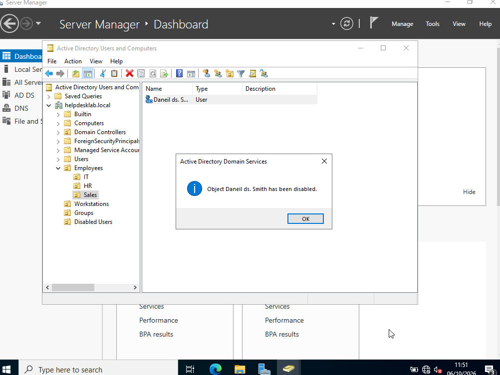

### CLIENT01 Network Configuration
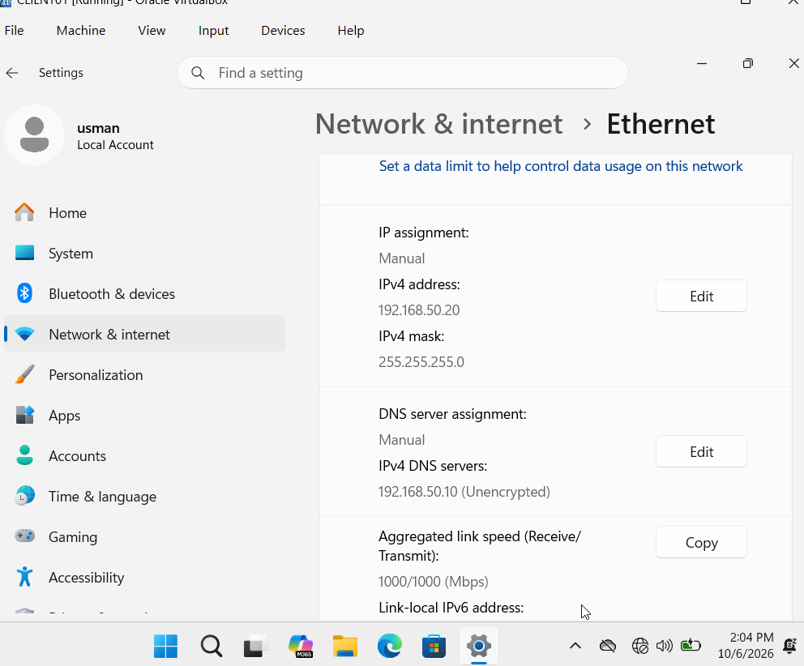

### Domain Authentication
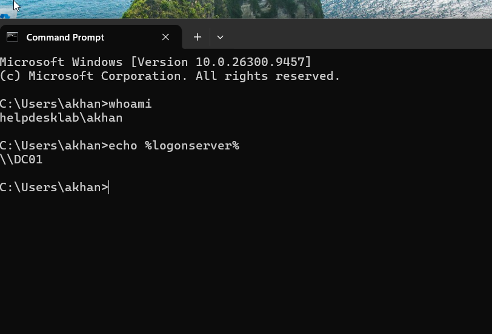

### CLIENT01 Hostname
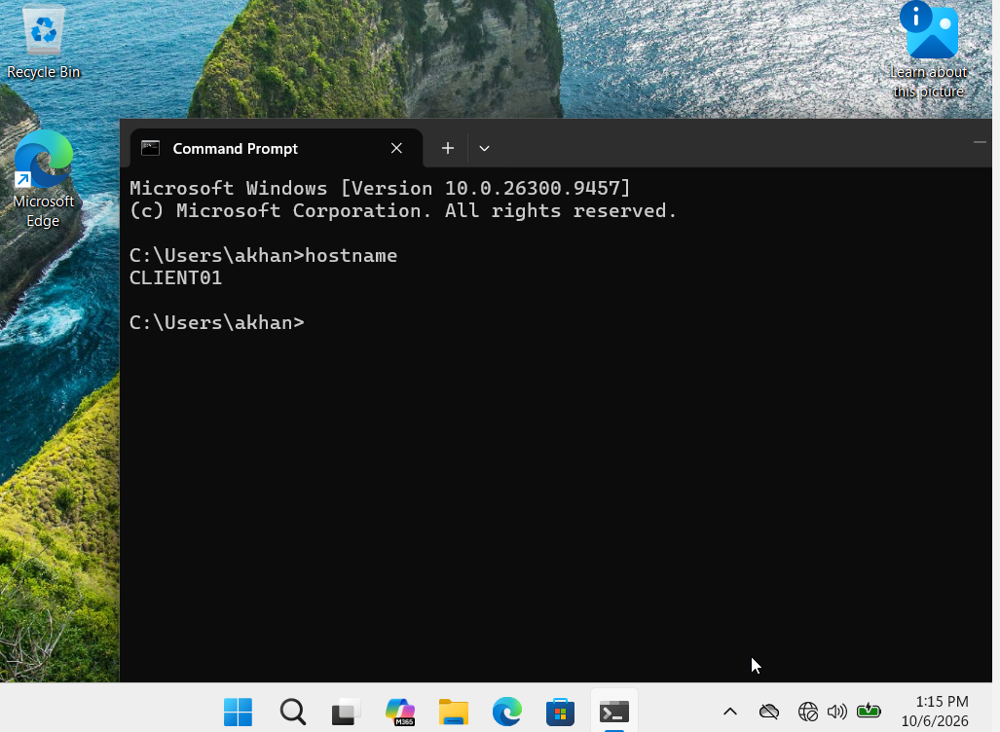

### Group Policy Update
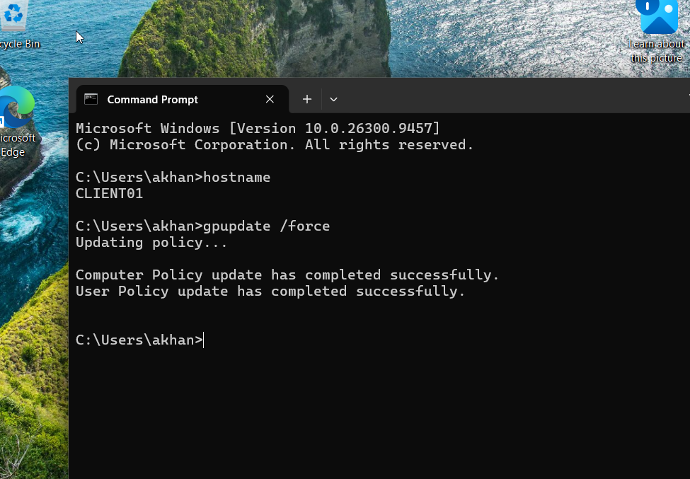

### Group Policy Verification
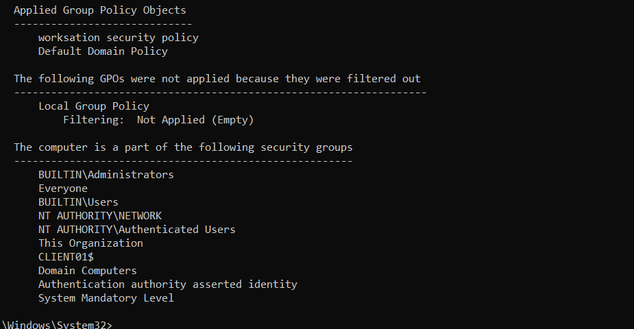

### GPO Linked to Workstations OU
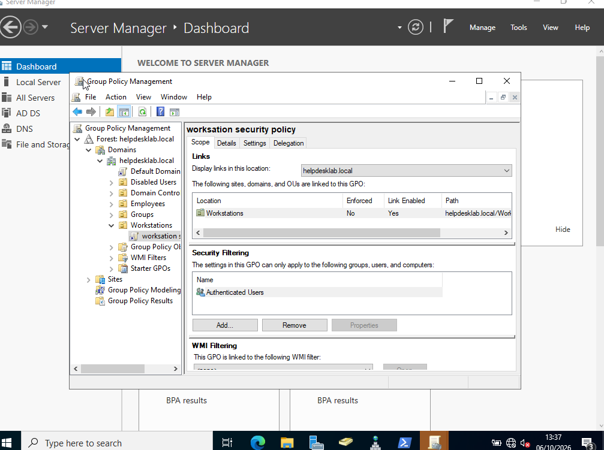

### Password Policy
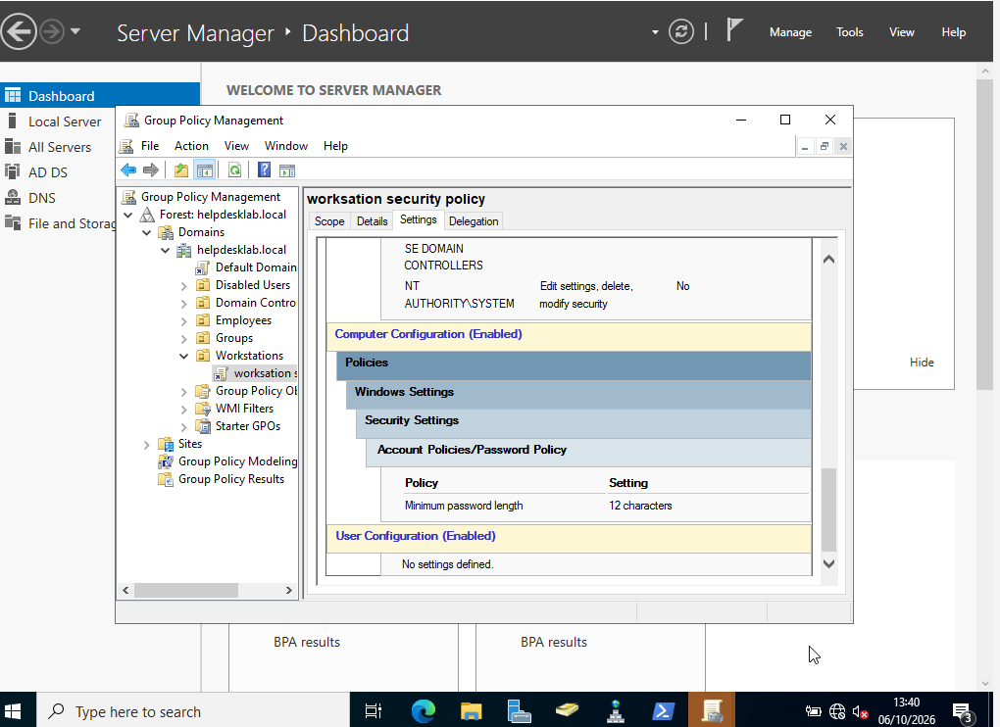

## What I Learned

This project gave me practical experience with how Active Directory is used in an IT support environment.

I learned why domain clients need to use the Domain Controller for DNS, how users, groups and OUs work together, how workstations are joined to a domain and how Group Policy can centrally configure domain computers.

The DNS issue also gave me practical troubleshooting experience. Rather than assuming the domain configuration was broken, I tested connectivity and DNS separately and narrowed the issue down to the firewall.

## CV Project Description

**Active Directory Helpdesk Lab** — Built a Windows Server 2022 Active Directory environment with a domain-joined Windows 11 workstation. Configured AD DS, DNS, OUs, users and security groups; performed password resets and account administration; deployed and verified Group Policy; and troubleshot DNS/firewall connectivity using tools including ping, nslookup, gpupdate and gpresult.

## Interview Talking Point

I built an Active Directory home lab using Windows Server 2022 and Windows 11. I configured a Domain Controller and DNS, created users, groups and OUs, joined a Windows 11 workstation to the domain and performed common helpdesk tasks such as password resets, group membership changes and disabling accounts.

I also created a workstation Group Policy and verified that it was successfully applied to the client. One issue I encountered was that the client could ping the Domain Controller but DNS queries timed out. I tested DNS locally on the server, identified that the service itself was working and resolved the issue by allowing DNS traffic through the server firewall. That gave me practical experience troubleshooting an issue from connectivity through to resolution.
